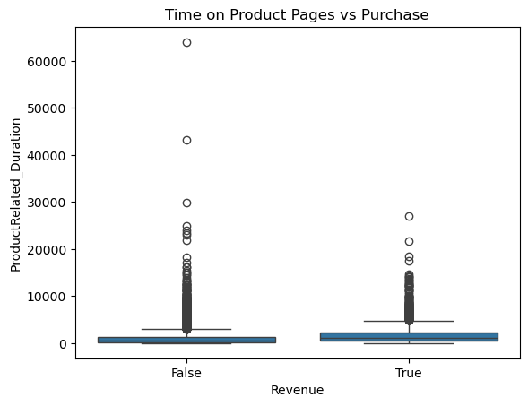

```python
# Step 2: Load libraries and dataset
import pandas as pd

# Load CSV
df = pd.read_csv("data/online_shoppers_intention.csv")

# Check first few rows
df.head()

```


<div>
<style scoped>
    .dataframe tbody tr th:only-of-type {
        vertical-align: middle;
    }

    .dataframe tbody tr th {
        vertical-align: top;
    }

    .dataframe thead th {
        text-align: right;
    }
</style>
<table border="1" class="dataframe">
  <thead>
    <tr style="text-align: right;">
      <th></th>
      <th>Administrative</th>
      <th>Administrative_Duration</th>
      <th>Informational</th>
      <th>Informational_Duration</th>
      <th>ProductRelated</th>
      <th>ProductRelated_Duration</th>
      <th>BounceRates</th>
      <th>ExitRates</th>
      <th>PageValues</th>
      <th>SpecialDay</th>
      <th>Month</th>
      <th>OperatingSystems</th>
      <th>Browser</th>
      <th>Region</th>
      <th>TrafficType</th>
      <th>VisitorType</th>
      <th>Weekend</th>
      <th>Revenue</th>
    </tr>
  </thead>
  <tbody>
    <tr>
      <th>0</th>
      <td>0</td>
      <td>0.0</td>
      <td>0</td>
      <td>0.0</td>
      <td>1</td>
      <td>0.000000</td>
      <td>0.20</td>
      <td>0.20</td>
      <td>0.0</td>
      <td>0.0</td>
      <td>Feb</td>
      <td>1</td>
      <td>1</td>
      <td>1</td>
      <td>1</td>
      <td>Returning_Visitor</td>
      <td>False</td>
      <td>False</td>
    </tr>
    <tr>
      <th>1</th>
      <td>0</td>
      <td>0.0</td>
      <td>0</td>
      <td>0.0</td>
      <td>2</td>
      <td>64.000000</td>
      <td>0.00</td>
      <td>0.10</td>
      <td>0.0</td>
      <td>0.0</td>
      <td>Feb</td>
      <td>2</td>
      <td>2</td>
      <td>1</td>
      <td>2</td>
      <td>Returning_Visitor</td>
      <td>False</td>
      <td>False</td>
    </tr>
    <tr>
      <th>2</th>
      <td>0</td>
      <td>0.0</td>
      <td>0</td>
      <td>0.0</td>
      <td>1</td>
      <td>0.000000</td>
      <td>0.20</td>
      <td>0.20</td>
      <td>0.0</td>
      <td>0.0</td>
      <td>Feb</td>
      <td>4</td>
      <td>1</td>
      <td>9</td>
      <td>3</td>
      <td>Returning_Visitor</td>
      <td>False</td>
      <td>False</td>
    </tr>
    <tr>
      <th>3</th>
      <td>0</td>
      <td>0.0</td>
      <td>0</td>
      <td>0.0</td>
      <td>2</td>
      <td>2.666667</td>
      <td>0.05</td>
      <td>0.14</td>
      <td>0.0</td>
      <td>0.0</td>
      <td>Feb</td>
      <td>3</td>
      <td>2</td>
      <td>2</td>
      <td>4</td>
      <td>Returning_Visitor</td>
      <td>False</td>
      <td>False</td>
    </tr>
    <tr>
      <th>4</th>
      <td>0</td>
      <td>0.0</td>
      <td>0</td>
      <td>0.0</td>
      <td>10</td>
      <td>627.500000</td>
      <td>0.02</td>
      <td>0.05</td>
      <td>0.0</td>
      <td>0.0</td>
      <td>Feb</td>
      <td>3</td>
      <td>3</td>
      <td>1</td>
      <td>4</td>
      <td>Returning_Visitor</td>
      <td>True</td>
      <td>False</td>
    </tr>
  </tbody>
</table>
</div>


```python
import matplotlib.pyplot as plt
import seaborn as sns


sns.countplot(x='Revenue', data=df)
plt.title("Revenue Distribution (Purchase vs No Purchase)")
plt.show()

print(df['Revenue'].value_counts(normalize=True))

```


    

    


    Revenue
    False    0.845255
    True     0.154745
    Name: proportion, dtype: float64
    


```python
df.describe()
```


<div>
<style scoped>
    .dataframe tbody tr th:only-of-type {
        vertical-align: middle;
    }

    .dataframe tbody tr th {
        vertical-align: top;
    }

    .dataframe thead th {
        text-align: right;
    }
</style>
<table border="1" class="dataframe">
  <thead>
    <tr style="text-align: right;">
      <th></th>
      <th>Administrative</th>
      <th>Administrative_Duration</th>
      <th>Informational</th>
      <th>Informational_Duration</th>
      <th>ProductRelated</th>
      <th>ProductRelated_Duration</th>
      <th>BounceRates</th>
      <th>ExitRates</th>
      <th>PageValues</th>
      <th>SpecialDay</th>
      <th>OperatingSystems</th>
      <th>Browser</th>
      <th>Region</th>
      <th>TrafficType</th>
    </tr>
  </thead>
  <tbody>
    <tr>
      <th>count</th>
      <td>12330.000000</td>
      <td>12330.000000</td>
      <td>12330.000000</td>
      <td>12330.000000</td>
      <td>12330.000000</td>
      <td>12330.000000</td>
      <td>12330.000000</td>
      <td>12330.000000</td>
      <td>12330.000000</td>
      <td>12330.000000</td>
      <td>12330.000000</td>
      <td>12330.000000</td>
      <td>12330.000000</td>
      <td>12330.000000</td>
    </tr>
    <tr>
      <th>mean</th>
      <td>2.315166</td>
      <td>80.818611</td>
      <td>0.503569</td>
      <td>34.472398</td>
      <td>31.731468</td>
      <td>1194.746220</td>
      <td>0.022191</td>
      <td>0.043073</td>
      <td>5.889258</td>
      <td>0.061427</td>
      <td>2.124006</td>
      <td>2.357097</td>
      <td>3.147364</td>
      <td>4.069586</td>
    </tr>
    <tr>
      <th>std</th>
      <td>3.321784</td>
      <td>176.779107</td>
      <td>1.270156</td>
      <td>140.749294</td>
      <td>44.475503</td>
      <td>1913.669288</td>
      <td>0.048488</td>
      <td>0.048597</td>
      <td>18.568437</td>
      <td>0.198917</td>
      <td>0.911325</td>
      <td>1.717277</td>
      <td>2.401591</td>
      <td>4.025169</td>
    </tr>
    <tr>
      <th>min</th>
      <td>0.000000</td>
      <td>0.000000</td>
      <td>0.000000</td>
      <td>0.000000</td>
      <td>0.000000</td>
      <td>0.000000</td>
      <td>0.000000</td>
      <td>0.000000</td>
      <td>0.000000</td>
      <td>0.000000</td>
      <td>1.000000</td>
      <td>1.000000</td>
      <td>1.000000</td>
      <td>1.000000</td>
    </tr>
    <tr>
      <th>25%</th>
      <td>0.000000</td>
      <td>0.000000</td>
      <td>0.000000</td>
      <td>0.000000</td>
      <td>7.000000</td>
      <td>184.137500</td>
      <td>0.000000</td>
      <td>0.014286</td>
      <td>0.000000</td>
      <td>0.000000</td>
      <td>2.000000</td>
      <td>2.000000</td>
      <td>1.000000</td>
      <td>2.000000</td>
    </tr>
    <tr>
      <th>50%</th>
      <td>1.000000</td>
      <td>7.500000</td>
      <td>0.000000</td>
      <td>0.000000</td>
      <td>18.000000</td>
      <td>598.936905</td>
      <td>0.003112</td>
      <td>0.025156</td>
      <td>0.000000</td>
      <td>0.000000</td>
      <td>2.000000</td>
      <td>2.000000</td>
      <td>3.000000</td>
      <td>2.000000</td>
    </tr>
    <tr>
      <th>75%</th>
      <td>4.000000</td>
      <td>93.256250</td>
      <td>0.000000</td>
      <td>0.000000</td>
      <td>38.000000</td>
      <td>1464.157214</td>
      <td>0.016813</td>
      <td>0.050000</td>
      <td>0.000000</td>
      <td>0.000000</td>
      <td>3.000000</td>
      <td>2.000000</td>
      <td>4.000000</td>
      <td>4.000000</td>
    </tr>
    <tr>
      <th>max</th>
      <td>27.000000</td>
      <td>3398.750000</td>
      <td>24.000000</td>
      <td>2549.375000</td>
      <td>705.000000</td>
      <td>63973.522230</td>
      <td>0.200000</td>
      <td>0.200000</td>
      <td>361.763742</td>
      <td>1.000000</td>
      <td>8.000000</td>
      <td>13.000000</td>
      <td>9.000000</td>
      <td>20.000000</td>
    </tr>
  </tbody>
</table>
</div>


```python
sns.boxplot(x='Revenue', y='ProductRelated_Duration', data=df)
plt.title("Time on Product Pages vs Purchase")
plt.show()

```


    

    


```python
sns.boxplot(x='Revenue', y='PageValues', data=df)
plt.title("Page Values vs Purchase")
plt.show()

```


    

    


```python
sns.countplot(x='VisitorType', hue='Revenue', data=df)
plt.title("Visitor Type vs Purchase")
plt.show()

sns.countplot(x='Weekend', hue='Revenue', data=df)
plt.title("Weekend vs Purchase")
plt.show()

```


    

    


    

    


```python
plt.figure(figsize=(12,10))
sns.heatmap(df.corr(), cmap="coolwarm", annot=True, fmt=".2f")
plt.title("Feature Correlations")
plt.show()

```


    ---------------------------------------------------------------------------

    ValueError                                Traceback (most recent call last)

    Cell In[15], line 2
          1 plt.figure(figsize=(12,10))
    ----> 2 sns.heatmap(df.corr(), cmap="coolwarm", annot=True, fmt=".2f")
          3 plt.title("Feature Correlations")
          4 plt.show()
    

    File ~\anaconda3\Lib\site-packages\pandas\core\frame.py:11049, in DataFrame.corr(self, method, min_periods, numeric_only)
      11047 cols = data.columns
      11048 idx = cols.copy()
    > 11049 mat = data.to_numpy(dtype=float, na_value=np.nan, copy=False)
      11051 if method == "pearson":
      11052     correl = libalgos.nancorr(mat, minp=min_periods)
    

    File ~\anaconda3\Lib\site-packages\pandas\core\frame.py:1993, in DataFrame.to_numpy(self, dtype, copy, na_value)
       1991 if dtype is not None:
       1992     dtype = np.dtype(dtype)
    -> 1993 result = self._mgr.as_array(dtype=dtype, copy=copy, na_value=na_value)
       1994 if result.dtype is not dtype:
       1995     result = np.asarray(result, dtype=dtype)
    

    File ~\anaconda3\Lib\site-packages\pandas\core\internals\managers.py:1694, in BlockManager.as_array(self, dtype, copy, na_value)
       1692         arr.flags.writeable = False
       1693 else:
    -> 1694     arr = self._interleave(dtype=dtype, na_value=na_value)
       1695     # The underlying data was copied within _interleave, so no need
       1696     # to further copy if copy=True or setting na_value
       1698 if na_value is lib.no_default:
    

    File ~\anaconda3\Lib\site-packages\pandas\core\internals\managers.py:1753, in BlockManager._interleave(self, dtype, na_value)
       1751     else:
       1752         arr = blk.get_values(dtype)
    -> 1753     result[rl.indexer] = arr
       1754     itemmask[rl.indexer] = 1
       1756 if not itemmask.all():
    

    ValueError: could not convert string to float: 'Feb'


    <Figure size 1200x1000 with 0 Axes>


```python
# Select only numeric columns
numeric_df = df.select_dtypes(include='number')

# Correlation heatmap
plt.figure(figsize=(12,10))
sns.heatmap(numeric_df.corr(), cmap="coolwarm", annot=True, fmt=".2f")
plt.title("Feature Correlations (Numeric Columns Only)")
plt.show()

```


    

    


```python
numeric_features = ['ProductRelated_Duration', 'BounceRates', 'ExitRates', 'PageValues']
for feature in numeric_features:
    plt.figure(figsize=(6,4))
    sns.boxplot(x='Revenue', y=feature, data=df)
    plt.title(f"{feature} vs Revenue")
    plt.show()


categorical_features = ['VisitorType', 'Weekend', 'Month', 'OperatingSystems', 'Browser', 'Region', 'TrafficType']

for feature in ['VisitorType','Weekend']:
    plt.figure(figsize=(6,4))
    sns.countplot(x=feature, hue='Revenue', data=df)
    plt.title(f"{feature} vs Revenue")
    plt.show()


```


    

    


    

    


    

    


    

    


    

    


    

    


```python
df.isnull().sum()

```


    Administrative             0
    Administrative_Duration    0
    Informational              0
    Informational_Duration     0
    ProductRelated             0
    ProductRelated_Duration    0
    BounceRates                0
    ExitRates                  0
    PageValues                 0
    SpecialDay                 0
    Month                      0
    OperatingSystems           0
    Browser                    0
    Region                     0
    TrafficType                0
    VisitorType                0
    Weekend                    0
    Revenue                    0
    dtype: int64


```python
df.fillna(0, inplace=True)

```


```python

df['Month'] = df['Month'].map({
    'Jan':1,'Feb':2,'Mar':3,'Apr':4,'May':5,'June':6,
    'Jul':7,'Aug':8,'Sep':9,'Oct':10,'Nov':11,'Dec':12
})

df['VisitorType'] = df['VisitorType'].map({'New_Visitor':0,'Returning_Visitor':1,'Other':2})
df['Weekend'] = df['Weekend'].astype(int)
df['Revenue'] = df['Revenue'].astype(int)

```


```python
from sklearn.preprocessing import StandardScaler


X = df.drop('Revenue', axis=1)
y = df['Revenue']

scaler = StandardScaler()
X_scaled = scaler.fit_transform(X)

```


```python
from sklearn.model_selection import train_test_split

X_train, X_test, y_train, y_test = train_test_split(
    X_scaled, y, test_size=0.2, random_state=42, stratify=y
)

```


```python
from sklearn.ensemble import RandomForestClassifier
from sklearn.metrics import accuracy_score, confusion_matrix, classification_report
# Initialize Random Forest
rf_model = RandomForestClassifier(
    n_estimators=100,    
    random_state=42,
    class_weight='balanced' 
)

rf_model.fit(X_train, y_train)

y_pred = rf_model.predict(X_test)

```


```python

print("Accuracy:", accuracy_score(y_test, y_pred))


cm = confusion_matrix(y_test, y_pred)
print("\nConfusion Matrix:\n", cm)


print("\nClassification Report:\n", classification_report(y_test, y_pred))

```

    Accuracy: 0.8953771289537713
    
    Confusion Matrix:
     [[2012   72]
     [ 186  196]]
    
    Classification Report:
                   precision    recall  f1-score   support
    
               0       0.92      0.97      0.94      2084
               1       0.73      0.51      0.60       382
    
        accuracy                           0.90      2466
       macro avg       0.82      0.74      0.77      2466
    weighted avg       0.89      0.90      0.89      2466
    
    


```python
import joblib
joblib.dump(rf_model, "rf_shopping_model.pkl")

new_user = [[0,0,0,0,5,120,0.05,0.10,20,0,2,3,1,4,1,1,0]] 
prediction = rf_model.predict(new_user)
print("Will buy?" , "Yes" if prediction[0]==1 else "No")

```

    Will buy? No
    


```python

```
